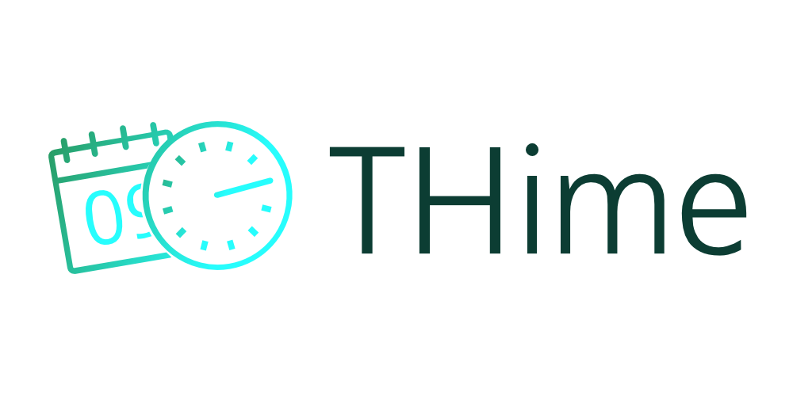
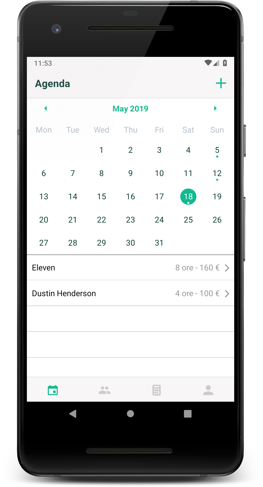
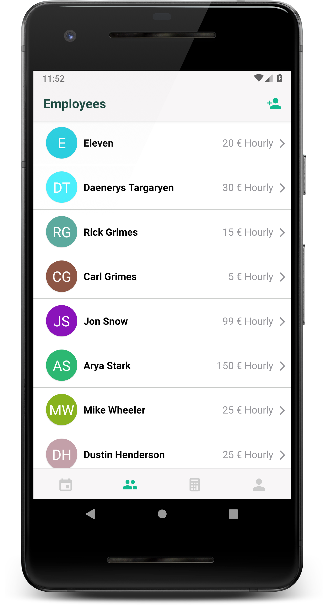
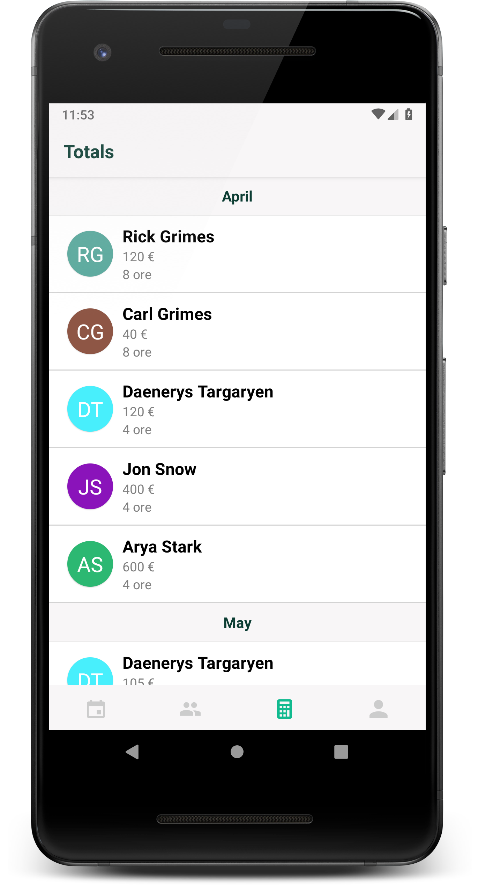
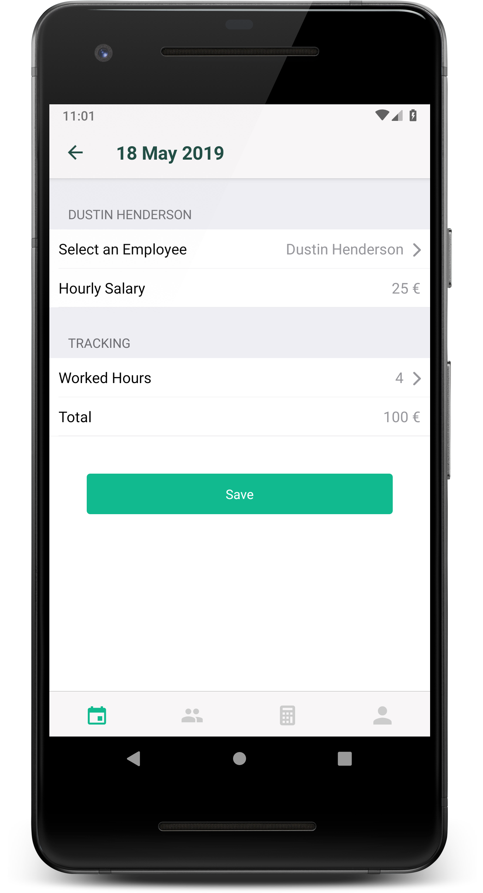

  

  

  <a href="https://thime.app">THime App landing page</a>

Simple **Time** **T**racker for your **H**uman Resources.

## Motivation
This project was born mainly to assist the [Movembik](https://www.facebook.com/Movembik/) Bar on time tracking of employees. It is also my first open source project in react-native 🤩.
 
## Screenshots

  
  
    
  

## Tech/framework used

- [Expo](https://expo.io)
- [Firebase](https://firebase.google.com)

## Features
- [x] Calendar
- [x] Employees management
- [x] Totals
- [x] Translation (IT/EN)
- [x] Login
- [ ] Registration
- [ ] Configure totals calculation
- [ ] Users Roles

## Contribute

Pull requests are welcome. File an issue for ideas, conversation or feedback.

## License
Mozilla Public License 2.0 (MPL-2.0)

MPL-2.0 © [Alex Bordin](mailto:bordin.alex@gmail.com)